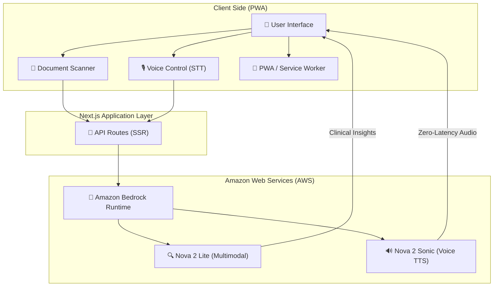

# 🏥 NovaDoc: Advanced AI Medical Assistant
**Empowering Healthcare with Amazon Nova Multimodal & Voice AI**

[](https://aws.amazon.com/bedrock/)
[](https://nextjs.org/)
[](https://web.dev/progressive-web-apps/)

## 🚀 Overview
NovaDoc is a state-of-the-art medical analytical tool designed for clinicians and patients to navigate complex medical documentation instantly. By leveraging the **Amazon Nova** foundation models, NovaDoc transforms static clinical data (PDFs, Lab Results, X-rays) into interactive, audible intelligence.

---

## 🏗️ System Architecture
The following diagram illustrates the high-level architecture of NovaDoc, showcasing the secure integration between the client-side PWA and the Amazon Bedrock backend.



---

## 🧠 Leveraging Amazon Nova
This project is built specifically for the **Amazon Nova Hackathon**, utilizing the most advanced features of the Nova ecosystem:

- **Multimodal Understanding (Nova 2 Lite)**: 
  Processes complex medical layouts, radiology images, and lab reports simultaneously with text queries. Users can upload a PDF and ask, *"Identify the outlier markers in this blood panel,"* and NovaDoc will visually and textually pinpoint them.
- **Real-time Voice Synthesis (Nova 2 Sonic)**: 
  Utilizes the **2026 Bidirectional Streaming API** for near-zero latency TTS. This ensures the assistant responds verbally in a way that feels natural and conversational, crucial for high-stress medical contexts.
- **Enterprise Guardrails**: 
  Implements strict medical system prompts to ensure the AI remains focused solely on healthcare analytics and terminology explanation.

---

## ✨ Key Features
- **Professional Clinical UI**: Premium dark mode with glassmorphism for a high-fidelity medical experience.
- **Multimodal Scanner**: Support for PDF, JPG, and PNG medical documents.
- **Progressive Web App (PWA)**: Fully installable on Android/iOS for a native-like experience.
- **Speech-to-Intelligence**: Integrated voice recording and synthesis.

---

## 🛠️ Technical Stack
- **AI/ML**: Amazon Bedrock (Nova 2 Lite, Nova 2 Sonic).
- **Frontend**: Next.js 15+, React 19, Vanilla CSS.
- **Development**: AWS SDK for JavaScript v3.
- **Hosting**: AWS Amplify (with CI/CD integration).

---

## 💻 Local Setup
1. **Clone & Install**:
   ```bash
   git clone https://github.com/parulmalhotraiitk/novadoc.git
   npm install
   ```

2. **Environment Configuration**:
   Create a `.env.local` file with:
   ```env
   APP_AWS_ACCESS_KEY_ID=your_access_key
   APP_AWS_SECRET_ACCESS_KEY=your_secret_key
   APP_AWS_REGION=us-east-1
   ```

3. **Run**:
   ```bash
   npm run dev
   ```

---

## 🏅 Hackathon Details
- **Primary Category**: Multimodal Understanding
- **Secondary Track**: Voice AI
- **Hashtag**: #AmazonNova

---
*Disclaimer: NovaDoc is an analytical assistant for medical professionals and patients. It is designed to explain medical terminology and documentation and should not be used as a primary diagnostic tool.*
